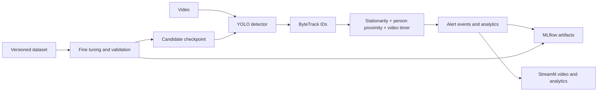

# Vision Lab — unattended luggage detection

YOLO11 + ByteTrack detection for bags without a nearby person, MLflow experiment
tracking, and a Streamlit dashboard. Annotated video plays first; luggage timers,
alerts and detection analytics appear directly below it.

**Default rule:** confirm stationarity for 3 seconds, then alert after 300 seconds
without a detected nearby person. Video time drives the timer. People approaching,
bag movement and long visibility gaps reset the episode.

This is an engineering prototype, not a validated station security system. An
alert does not establish ownership or danger. Pretrained weights recognize
backpacks, handbags and suitcases; other bags need labeled station footage and
further training. See [observed results](docs/VALIDATION.md).

## Run locally

Install [uv](https://docs.astral.sh/uv/getting-started/installation/), then:

```powershell
git clone https://github.com/AI-King/abandoned_bag_detection.git
cd abandoned_bag_detection
uv sync --locked
uv run vision prepare
uv run streamlit run app.py --server.address 127.0.0.1
```

Open [the dashboard](http://127.0.0.1:8501). Choose CAVIAR footage or upload video,
select a model and threshold, then **Analyze video**. Python 3.12 and CPU PyTorch
are locked. Model/data downloads are checksum verified. On Windows,
`./scripts/start.ps1` sets up and starts an existing checkout.

Run the experiment viewer in another terminal:

```powershell
uv run mlflow ui --backend-store-uri sqlite:///mlflow.db --host 127.0.0.1 --port 5000
```

[MLflow](http://127.0.0.1:5000) records training, evaluation and inference parameters,
metrics, Git state, model/data hashes and artifacts.

## Video testing and training

```powershell
# CAVIAR lasts under a minute: explicitly shorten the threshold for a quick test.
uv run vision infer data/videos/LeftBag.mp4 --alert-seconds 10

# Test the real five-minute timer with a clearly synthetic repeated-photo video.
uv run vision fixture
uv run vision infer data/videos/Synthetic_Timer_310s.mp4

# Fast training smoke test.
uv run vision train --epochs 1 --image-size 320

# Four-class starter dataset; candidates do not replace the default detector.
uv run vision train --data data/datasets/luggage-mini.yaml --epochs 30 --image-size 640

# Replace RUN_ID with the exact checkpoint path printed by training.
uv run vision evaluate --data data/datasets/luggage-mini.yaml --model models/RUN_ID-best.pt
uv run vision infer --help
```

COCO8 checks pipeline execution. `luggage-mini` is a small, disjoint development
split from COCO128 with very few bags. CAVIAR provides public left-bag and pickup
footage. The synthetic video tests timer plumbing only. See
[data sources and licenses](docs/DATASETS.md).

For station training, copy `configs/custom-luggage.example.yaml`, set the absolute
dataset path, and train with `--data`. Use YOLO text labels and split by
camera/day/scene. Add a generic `bag` class for other bag forms.

## Architecture



The dashboard and CLI share the streaming pipeline. FastAPI is unnecessary for
this local app; the Python API can later sit behind an API/worker service.

| Path | Contents |
| --- | --- |
| `src/vision_lab/` | Inference, alert state machine, training and dashboard |
| `tests/` | Behavioral, media/MLflow, dataset and dashboard tests |
| `configs/` | Source checksum lock and custom dataset example |
| `data/` | Downloaded datasets, annotations and videos; ignored by Git |
| `models/` | Pretrained and MLflow-named candidates; ignored by Git |
| `outputs/RUN/` | Annotated MP4, CSV analytics, event/config/summary JSON |
| `mlflow.db`, `mlartifacts/` | Experiment database and artifacts; ignored by Git |

## Quality and delivery

```powershell
uv run pre-commit install
uv run ruff check .
uv run ruff format --check .
uv run pytest
```

Use `uv run pytest -m "not integration"` before downloading real model assets.
GitHub Actions checks Windows/Linux and runs a training smoke test. Release tags
trigger a checked container build and GHCR publication. Compose runs Streamlit
and MLflow with persistent storage. See [OPERATIONS.md](docs/OPERATIONS.md) for
the policy, deployment and limits. Code is AGPL-3.0-or-later; datasets retain their
upstream licenses.
